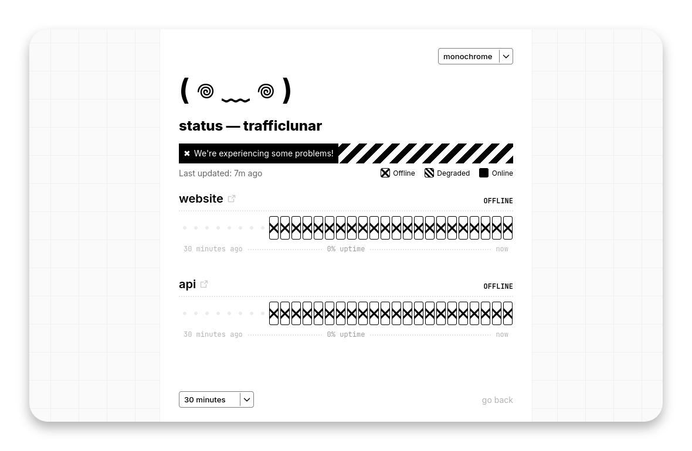

<h1 align="center">statsys</h1>



<p align="center">the cutest lightweight status page</p>
<h4 align="center"><a href="https://status.trafficlunar.net">view demo</a> | <a href="#install">install</a></h4>

## install

<details>
<summary><strong>docker compose (recommended)</strong></summary>
<br>

Create a `docker-compose.yaml` file:

```yaml
services:
  statsys:
    container_name: statsys
    image: trafficlunar/statsys
    restart: unless-stopped
    volumes:
      - ./data/:/app/data/
    ports:
      - 8888:8888
```

Create a new directory called `data` and download the `config.toml` example and edit it:

```bash
mkdir data && cd data
wget https://raw.githubusercontent.com/trafficlunar/statsys/refs/heads/main/config.toml
```

When ready, run:

```bash
docker compose up -d
```

Navigate to `localhost:8888` to view your status page!

</details>

<details>
<summary><strong>docker quick run</strong></summary>
<br>

Create a new directory called `data` and download the `config.toml` example and edit it:

```bash
mkdir data && cd data
wget https://raw.githubusercontent.com/trafficlunar/statsys/refs/heads/main/config.toml
```

Launch the container:

```bash
docker run -d \
  --name statsys \
  --restart unless-stopped \
  -v "$(pwd)/data:/app/data" \
  -p 8888:8888 \
  trafficlunar/statsys
```

Navigate to `localhost:8888` to view your status page!

</details>

<details>
<summary><strong>manual</strong></summary>
<br>

TODO

</details>
